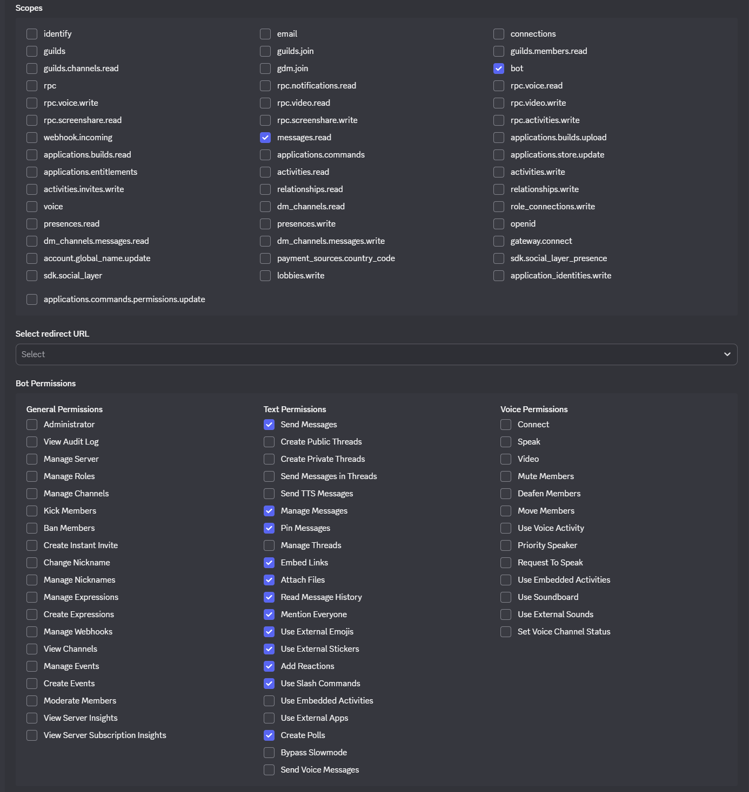

# Persona Creator Skill

Scaffolds new AI personas with folder structure, config, and GitHub repo. Includes setup guidance for Discord bots and API keys.

## Commands

### create-persona

Create a new AI persona with folder structure, config, and GitHub repo.

```bash
clawdbot skill run goc-persona --create-persona <persona-name> [--model <model>] [--description <desc>]
```

**Arguments:**

| Argument | Required | Default | Description |
|----------|----------|---------|-------------|
| `name` | Yes | - | Persona name (e.g., `green-open`) |
| `model` | No | `minimax/MiniMax-M2.1` | Default model for the persona |
| `description` | No | `""` | Persona description |

**Examples:**

```bash
# Create a basic persona with default model
clawdbot skill run goc-persona --create-persona green-open

# Create a persona with a specific model
clawdbot skill run goc-persona --create-persona green-open --model gpt-4

# Create a persona with description
clawdbot skill run goc-persona --create-persona my-persona --description "A helpful coding assistant"
```

**After creation**, you'll see setup guidance with:
- Discord bot setup steps (including making it private)
- API key configuration commands
- Next steps to get your persona ready

---

### setup

Show detailed setup guide for a persona. Includes Discord bot setup instructions and API key configuration.

```bash
clawdbot skill run goc-persona --setup <persona-name>
```

**What it displays:**

- Discord bot creation and configuration
- Required permissions and intents
- How to get Guild ID and Channel IDs
- API key configuration commands
- `config.yaml` Discord settings template
- Troubleshooting tips

**Example output:**

```
🔧 SETUP GUIDE: developer
═══════════════════════════════════════════════════════════

## 📖 Discord Bot Setup

Create a bot at the Discord Developer Portal: https://discord.com/developers/applications

1. **Create Bot**
   - Click "New Application" → name it (e.g., `developer-bot`)
   - Go to Bot → Add Bot

2. **🔴 Enable Gateway Intents (scroll down in Bot settings)**
   
   | Intent | Enable? | Why |
   |--------|---------|-----|
   | **Server Members Intent** | ✅ YES | See who talks to the bot |
   | **Message Content Intent** | ✅ YES ⭐ | **REQUIRED** to read & respond |
   | **Presence Intent** | ❌ NO | Not needed |

3. **❌ Uncheck "Public Bot"** (keep private)
4. Copy the **Bot Token** (keep it secret!)

5. **Guild ID (Server ID)**
   - Enable Developer Mode in Discord settings
   - Right-click your server → Copy ID

6. **Channel IDs**
   - Enable Developer Mode
   - Right-click target channels → Copy ID

### Required Permissions

Use the Discord Developer Portal's URL generator with these permissions:

**Essential:**
- ✅ View Channels
- ✅ Send Messages
- ✅ Manage Messages
- ✅ Embed Links
- ✅ Attach Files
- ✅ Read Message History
- ✅ Add Reactions
- ✅ Use Slash Commands
- ✅ Mention Everyone (@bot-to-bot mentions)
- ✅ Manage Threads
- ✅ Create Public Threads
- ✅ Create Private Threads
- ✅ Send Messages in Threads
- ✅ Pin Messages
- ✅ Manage Webhooks

**Optional:**
- ✅ Use External Emojis
- ✅ Use External Stickers
- ✅ Create Polls
- ✅ Bypass Slowmode
- ✅ Send TTS Messages

### Generate Invite Link

In Discord Developer Portal → OAuth2 → URL Generator:

**1. Scope:** `bot`

**2. Permissions (check these boxes):**



| Category | Permissions |
|----------|-------------|
| Text | Send Messages, Read Message History, Embed Links, Attach Files, Add Reactions, Use Slash Commands, Manage Messages, Pin Messages, Manage Threads |
| Advanced | Mention Everyone |
| Extended | Use External Emojis, Use External Stickers, Create Polls |

**3. Copy the generated URL** and open it to invite the bot.

### API Keys Configuration:

clawdbot skill run goc-persona --add-key developer openai
clawdbot skill run goc-persona --add-key developer anthropic
clawdbot skill run goc-persona --add-key developer elevenlabs
clawdbot skill run goc-persona --add-key developer discord
```

---

### list

List all registered personas with their status and configured keys.

```bash
clawdbot skill run goc-persona --list
```

**Output includes:**
- Persona name and status (ready, needs-setup, error)
- GitHub repository URL
- Configured keys
- Missing keys

---

### status

Show detailed status and configuration for a specific persona.

```bash
clawdbot skill run goc-persona --status <persona-name>
```

**Shows:**
- Current status
- Repository and path
- Created/updated timestamps
- Configured keys with dates
- Missing keys
- Readiness indicator

---

### add-key

Mark an API key as configured for a persona.

```bash
clawdbot skill run goc-persona --add-key <persona-name> <key-type>
```

**Common key types:**
- `openai` - OpenAI API (GPT-4)
- `anthropic` - Anthropic API (Claude)
- `elevenlabs` - ElevenLabs TTS
- `huggingface` - Hugging Face
- `discord` - Discord Bot Token
- `google` - Google Cloud

**Example:**

```bash
clawdbot skill run goc-persona --add-key developer openai
clawdbot skill run goc-persona --add-key developer anthropic
clawdbot skill run goc-persona --add-key developer discord
```

---

### register

Manually register an existing persona folder.

```bash
clawdbot skill run goc-persona --register <persona-name> [--repo <org/repo>] [--path <path>]
```

---

### unregister

Remove a persona from the registry.

```bash
clawdbot skill run goc-persona --unregister <persona-name>
```

---

## What It Creates

For a persona named `green-open`, the skill creates:

```
~/personas/green-open/
├── .gitkeep          # Keeps skills/ folder in git
├── IDENTITY.md       # Persona identity document
├── SOUL.md           # Persona soul/personality document
├── config.yaml       # Persona configuration
├── memory/
│   └── .gitkeep      # Keeps memory/ folder in git
└── skills/
    └── .gitkeep      # Place skills here
```

And creates the GitHub repository:

- **Repo name**: `goc-persona-green-open`
- **Repo URL**: `https://github.com/greenclawdbot/goc-persona-green-open`

## Generated Files

### config.yaml

```yaml
# Persona Configuration for green-open

defaultModel: minimax/MiniMax-M2.1

# Skills available to this persona
skills: []

# Personality settings
personality:
  tone: neutral
  verbosity: medium
  creativity: 0.7

# Memory settings
memory:
  enabled: true
  maxEntries: 100

# Model-specific settings
modelSettings:
  temperature: 0.7
  maxTokens: 4096
```

### IDENTITY.md

Template for documenting the persona's core identity, role, purpose, and expertise.

### SOUL.md

Template for defining the persona's personality, behavioral guidelines, and constraints.

## GitHub Integration

The skill automatically:

1. Initializes a git repository
2. Creates a public GitHub repository under `greenclawdbot` organization
3. Commits all scaffolded files
4. Pushes to GitHub

Repository URL: `https://github.com/greenclawdbot/goc-persona-{persona-name}`

## After Creation

1. **Run setup guide**: `clawdbot skill run goc-persona --setup <persona-name>`
2. **Configure API keys**: `clawdbot skill run goc-persona --add-key <persona-name> <key-type>`
3. **Edit `IDENTITY.md`** with the persona's identity
4. **Edit `SOUL.md`** with the persona's personality
5. **Customize `config.yaml`** with Discord channels and settings
6. **Check status**: `clawdbot skill run goc-persona --status <persona-name>`

## Setup Guide

The skill includes a detailed [setup-guide.md](setup-guide.md) with:

- Discord bot creation step-by-step
- Required permissions and intents
- How to get Guild ID and Channel IDs
- API key configuration
- `config.yaml` Discord configuration
- Testing and troubleshooting tips
